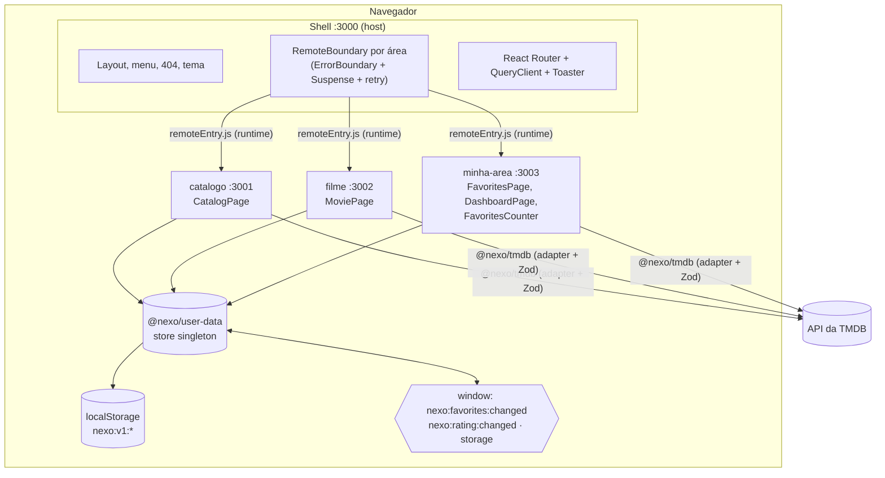

# Nexo Filmes

Portal de catálogo de filmes em micro-frontends. O usuário explora filmes da
[TMDB](https://www.themoviedb.org/), guarda favoritos e dá nota e comentário
ao que assistiu. Os dados do usuário ficam no navegador, atrás de um
repositório assíncrono que simula um back-end, com latência e falhas.

Três times evoluem partes diferentes do portal, cada um no seu ritmo. Por
isso o produto é dividido desde o início em um **Shell** e três **remotes**
ligados por Module Federation.

| Tela         | Rota                         | Micro-frontend |
| ------------ | ---------------------------- | -------------- |
| Catálogo     | `/filmes?q=&genero=&pagina=` | `catalogo`     |
| Detalhe      | `/filme/:id`                 | `filme`        |
| Favoritos    | `/favoritos`                 | `minha-area`   |
| Painel       | `/painel`                    | `minha-area`   |
| Contador     | cabeçalho de todas as telas  | `minha-area`   |
| Layout e 404 | `/`, `*`                     | `shell`        |

## Arquitetura



```
nexo-filmes/
├─ apps/                  micro-frontends (deploy independente)
│  ├─ shell/              host: layout, rotas de topo, carregamento isolado dos remotes
│  ├─ catalogo/           /filmes
│  ├─ filme/              /filme/:id (detalhe + avaliação)
│  └─ minha-area/         /favoritos, /painel e o contador do cabeçalho
├─ packages/              bibliotecas (nunca importam apps)
│  ├─ contracts/          só tipos: domínio, eventos, rotas, módulos expostos
│  ├─ tmdb/               cliente HTTP, schemas Zod, adapter TMDB → domínio, TMDB simulada
│  ├─ user-data/          repositório local, store otimista, eventos tipados
│  ├─ ui/                 design system (shadcn/ui + Tailwind v4 + Radix)
│  ├─ testing/            helpers de teste compartilhados
│  └─ config/             tsconfig, ESLint, Vitest, Module Federation, PostCSS
├─ e2e/                   testes Playwright contra o build de produção
└─ docs/adr/              decisões de arquitetura
```

**Regras de fronteira.** Nenhum micro-frontend importa código de outro. Eles
conversam só por URL, por eventos tipados em `window` e por tipos de
`@nexo/contracts`. O ESLint falha se um app importar outro, se alguém
importar valores (e não tipos) de `@nexo/contracts` ou se alguém usar o
`localStorage` fora de `@nexo/user-data`. Detalhes no
[ADR 0001](docs/adr/0001-fronteira-entre-apps-e-pacotes.md).

## Pré-requisitos

- **Node.js 24** (ver `.node-version`).
- **pnpm 12.9.1**, a versão fixada em `packageManager`. O jeito mais simples é
  o corepack, que vem com o Node:

  ```bash
  corepack enable pnpm
  ```

  No Windows esse comando pode pedir um terminal de administrador. Sem
  permissão, use `npm install -g pnpm@12.9.1`.

- **Token da TMDB**, opcional se você usar o modo simulado (abaixo):
  1. Crie uma conta em <https://www.themoviedb.org/signup>.
  2. Em <https://www.themoviedb.org/settings/api>, solicite uma chave de API.
  3. Copie o **API Read Access Token** (o token longo, v4).

## Como rodar

```bash
cp .env.example .env    # cole o token em VITE_TMDB_TOKEN
pnpm install
pnpm dev
```

Abra <http://localhost:3000>. O `pnpm dev` sobe os quatro dev servers em
paralelo pelo Turborepo.

**Sem token?** Use a TMDB simulada, um catálogo de demonstração servido por
um service worker (MSW), com busca, filtro por gênero, detalhe e pôsteres
gerados. Nenhuma chamada sai para a TMDB.

```bash
VITE_TMDB_MOCK=true pnpm dev        # bash/zsh
$env:VITE_TMDB_MOCK='true'; pnpm dev # PowerShell
```

Ou coloque `VITE_TMDB_MOCK=true` no `.env`. No modo simulado, buscar por
`erro429` faz a API responder 429, e o filme **O Auto da Compadecida**
(id 413) termina em 13, então favoritá-lo sempre falha.

### Cada remote isolado

Cada remote tem um mini-shell de desenvolvimento que reproduz o que o Shell
fornece (roteador, QueryClient, Toaster, estilos de base).

| App        | Comando                              | Porta                             |
| ---------- | ------------------------------------ | --------------------------------- |
| Shell      | `pnpm --filter @nexo/shell dev`      | <http://localhost:3000>           |
| Catálogo   | `pnpm --filter @nexo/catalogo dev`   | <http://localhost:3001/filmes>    |
| Filme      | `pnpm --filter @nexo/filme dev`      | <http://localhost:3002/filme/598> |
| Minha área | `pnpm --filter @nexo/minha-area dev` | <http://localhost:3003/favoritos> |

### Produção local

```bash
pnpm build     # build dos quatro apps
pnpm preview   # serve os builds nas mesmas portas
```

O build do Shell gera `apps/shell/dist/remotes.json` com as URLs dos remotes.
O Shell lê esse arquivo no boot, então dá para apontar para outros endereços
sem rebuild. Se o arquivo faltar ou estiver inválido, valem as URLs do build.

## Variáveis de ambiente

Todas ficam no `.env` da raiz (que não é versionado). Veja `.env.example`.

| Variável                      | Padrão                                 | Para quê                                                       |
| ----------------------------- | -------------------------------------- | -------------------------------------------------------------- |
| `VITE_TMDB_TOKEN`             | vazio                                  | Token de leitura da TMDB                                       |
| `VITE_TMDB_MOCK`              | `false`                                | `true` liga a TMDB simulada (MSW)                              |
| `VITE_USER_DATA_MIN_DELAY_MS` | `300`                                  | Atraso mínimo de cada operação do repositório local            |
| `VITE_USER_DATA_MAX_DELAY_MS` | `1500`                                 | Atraso máximo (sorteado a cada operação)                       |
| `VITE_USER_DATA_FAIL_SUFFIX`  | `13`                                   | Escritas em filmes cujo id termina nisso falham. Vazio desliga |
| `VITE_REMOTE_CATALOGO_URL`    | `http://localhost:3001/remoteEntry.js` | URL do remote no build do Shell                                |
| `VITE_REMOTE_FILME_URL`       | `http://localhost:3002/remoteEntry.js` | Idem                                                           |
| `VITE_REMOTE_MINHA_AREA_URL`  | `http://localhost:3003/remoteEntry.js` | Idem                                                           |

Nos testes, o atraso é `0` e a falha é desligada por injeção de dependência.
A regra do 13 tem testes próprios.

## Testes

```bash
pnpm test               # Vitest em todos os pacotes e apps
pnpm test --coverage    # com cobertura (relatório em coverage/index.html)
pnpm test:e2e           # Playwright contra o build de produção (TMDB simulada)
```

- **Unitários e de componente** (Vitest, Testing Library, user-event, MSW).
  Nenhum teste chama a TMDB real: o MSW intercepta tudo e falha em
  requisições não previstas.
- **Cobertura mínima de 70%** em linhas, funções, branches e statements,
  configurada em `vitest.config.ts` e restrita às pastas de regras de
  negócio: `packages/tmdb`, `packages/user-data` e `apps/*/src/domain`. A
  cobertura atual nessas pastas é de cerca de 96% das linhas.
- **E2E** (Playwright): cópia única de React e do roteador, queda isolada de
  um remote com retry, favorito sincronizado entre telas e abas, rollback do
  id terminado em 13, estado na URL, 429, formulário de avaliação, 360 px,
  teclado e varredura WCAG 2.1 AA com axe nas cinco telas, nos temas claro e
  escuro. Na primeira vez, rode `pnpm exec playwright install chromium`.

O CI (`.github/workflows/ci.yml`) roda formatação, lint, typecheck, testes
com cobertura, build e E2E.

## Como verificar que há uma só cópia de React e do roteador

React, React DOM, React Router, TanStack Query, sonner e `@nexo/user-data`
são declarados com `singleton: true` e `requiredVersion` em
`packages/config/federation.js`, usado pelos quatro apps.

No navegador, com o portal aberto em <http://localhost:3000/filmes>, rode no
console:

```js
Object.entries(__FEDERATION__.__SHARE__)
  .flatMap(([, scopes]) =>
    Object.values(scopes).flatMap((pkgs) =>
      Object.entries(pkgs).flatMap(([name, versions]) =>
        Object.entries(versions)
          .filter(([, info]) => info.loaded)
          .map(([version, info]) => `${name}@${version} ← ${info.from}`),
      ),
    ),
  )
  .filter((line, i, all) => all.indexOf(line) === i);
```

Cada pacote deve aparecer **uma vez**, fornecido pelo `shell`, por exemplo
`react@19.3.0 ← shell` e `react-router@8.4.0 ← shell`. Na aba Network, filtre
por `react-dom`: o arquivo vem só da porta 3000, nunca das portas dos
remotes. O teste E2E "React, React DOM e React Router existem uma única vez
na página" faz essa verificação automaticamente.

## Decisões técnicas

| ADR                                                     | Decisão                                                                   |
| ------------------------------------------------------- | ------------------------------------------------------------------------- |
| [0001](docs/adr/0001-fronteira-entre-apps-e-pacotes.md) | Fronteira entre micro-frontends e bibliotecas                             |
| [0002](docs/adr/0002-vite-module-federation.md)         | Vite + `@module-federation/vite`, com remotes registrados em runtime      |
| [0003](docs/adr/0003-busca-com-filtro-de-genero.md)     | Busca por título com filtro de gênero aplicado sobre a página da busca    |
| [0004](docs/adr/0004-estrategia-de-css.md)              | Base de CSS no Shell e utilitários de cada remote confinados com `@scope` |
| [0005](docs/adr/0005-estado-do-usuario.md)              | Repositório local, store otimista e sincronização por eventos             |

Outros pontos e trade-offs:

- **Versões.** TypeScript 6.0 e ESLint 9, e não as versões 7 e 10 já
  publicadas: o `typescript-eslint` só aceita TypeScript abaixo de 6.1 e o
  `eslint-plugin-jsx-a11y` ainda não declara suporte ao ESLint 10.
- **Camada anticorrupção.** Só `@nexo/tmdb` conhece os DTOs da TMDB. As
  respostas são validadas com Zod na fronteira. Um item inválido numa lista é
  descartado sem derrubar a página.
- **Busca.** Debounce de 400 ms no evento de digitação; a URL só muda depois
  da pausa, e o TanStack Query cancela a requisição anterior pelo
  `AbortSignal`. Um 429 nunca é repetido automaticamente; erros de rede ou
  5xx têm no máximo uma nova tentativa.
- **Favorito pendente.** O botão fica com `aria-disabled` e `aria-busy`, não
  com `disabled`, para que o foco do teclado não se perca enquanto salva.
- **Nota da avaliação.** Campo de texto decimal que aceita `7,5` ou `7.5`,
  para que as regras de limite e de passo apareçam na tela. O schema reusa
  as regras do repositório.
- **Retry real de remote.** O Chrome memoriza um `import()` que falhou; a
  nova tentativa registra o remote com `?tentativa=N` para buscar o
  `remoteEntry.js` de novo (ADR 0002).
- **Tema.** Claro e escuro com tokens CSS. A preferência é guardada por
  `@nexo/user-data`, já que só ele pode usar o localStorage.

## Acessibilidade e responsividade

Verificado manualmente no Chrome e automatizado no E2E:

- Em **360 px** nenhuma das cinco telas tem rolagem horizontal. O catálogo e
  os favoritos usam duas colunas, e o cabeçalho quebra a navegação em uma
  segunda linha.
- **Só teclado:** o primeiro Tab leva ao link "Pular para o conteúdo"; a
  ordem segue busca, gênero e cards (favoritar, depois o título); a
  navegação move o foco para o `h1` e atualiza `document.title`; ao remover
  um favorito, o foco vai para o resumo da lista; ao trocar de página, para o
  início dos resultados.
- **Leitor de tela:** `aria-live` anuncia o salvamento do favorito, a
  quantidade de resultados da busca e o status da avaliação. O botão de
  favorito usa `aria-pressed` e rótulo dinâmico.
- **Contraste:** sem violações WCAG 2.1 AA pelo axe nos dois temas.

## O que ficou de fora e por quê

- **BFF para esconder o token.** O token de leitura da TMDB vai no bundle do
  navegador, como em qualquer SPA sem back-end. É um token só de leitura, mas
  em produção ele deveria ficar atrás de um proxy. Ficou fora por exigir
  infraestrutura de servidor além do escopo atual.
- **Ordenação do catálogo.** A lista segue a popularidade da TMDB. A
  ordenação conflita com a busca da mesma forma que o gênero (ADR 0003) e
  pediria outra decisão de UX.
- **Docker e Storybook.** Não implementados. O mini-shell de cada remote já
  cobre parte do papel do Storybook no desenvolvimento isolado.
- **Tipos gerados pelo Module Federation (`dts`).** Desligados. Os tipos dos
  módulos expostos vêm de `@nexo/contracts`, e o Shell valida em runtime que
  cada módulo exporta um componente.
- **E2E em Firefox e Safari.** O Playwright roda só no Chromium. O `@scope`,
  usado para isolar o CSS dos remotes, exige Firefox 146+ e Safari 17.4+.
- **Teste com leitor de tela real.** A semântica foi verificada por axe e
  pela árvore de acessibilidade, mas não com NVDA ou VoiceOver.
- **Pendências entre abas.** Outra aba vê só o resultado confirmado de um
  favorito, não o estado "salvando".
